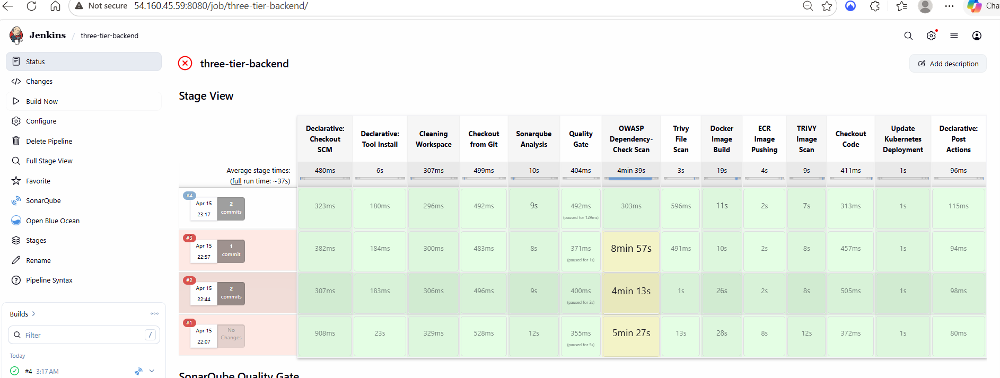
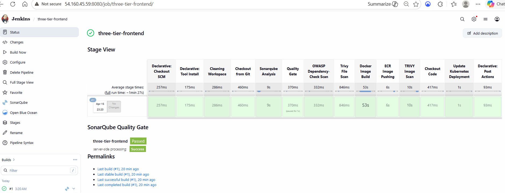
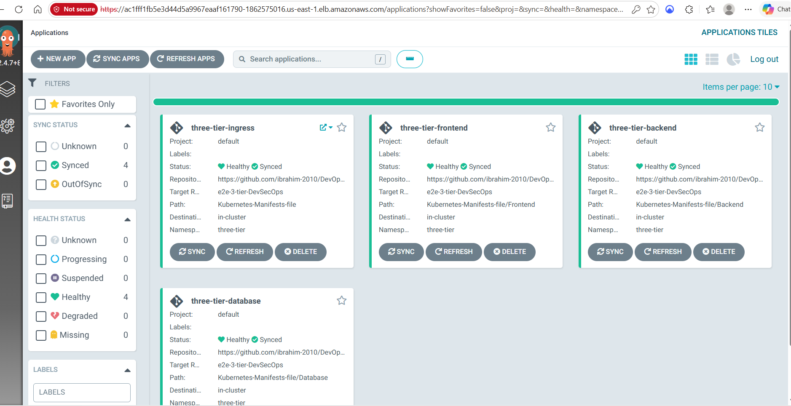
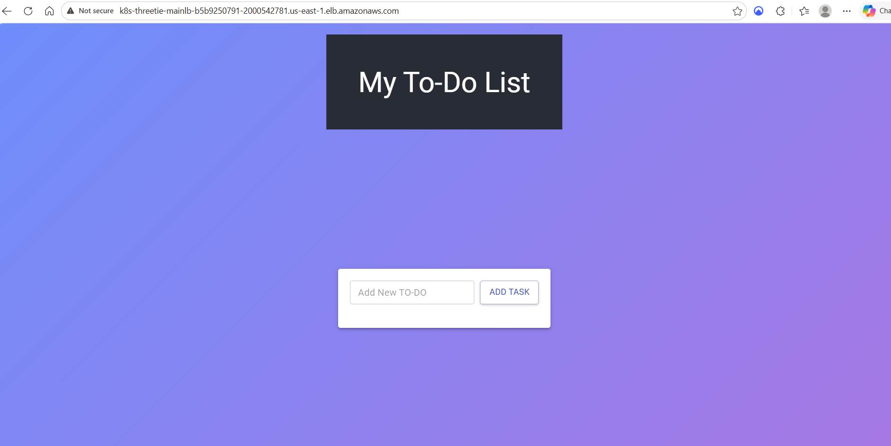
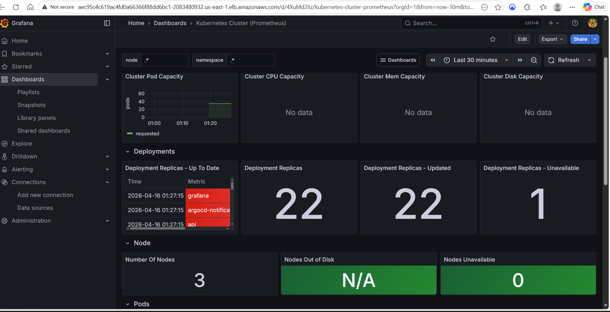

# Advanced End-to-End DevSecOps Kubernetes Three-Tier Project

[](https://aws.amazon.com/eks/)
[](https://kubernetes.io/)
[](https://www.terraform.io/)
[](https://www.jenkins.io/)
[](https://argo-cd.readthedocs.io/)

A production-grade DevSecOps pipeline that deploys a three-tier application (React frontend + Node.js API + MongoDB) to Amazon EKS, fully automated from commit to cluster with integrated security scanning, GitOps delivery, and observability.

---

## Table of Contents

1. [Architecture](#architecture)
2. [Results](#results)
3. [Technology Stack](#technology-stack)
4. [Project Workflow](#project-workflow)
5. [Prerequisites](#prerequisites)
6. [Step-by-Step Setup](#step-by-step-setup)
7. [Pipeline Flow](#pipeline-flow)
8. [Common Issues & Fixes](#common-issues--fixes)
9. [Teardown](#teardown)
10. [Cost Breakdown](#cost-breakdown)
11. [License](#license)

---

## Architecture


```
                   ┌──────────────────────────────────────────────┐
                   │              GitHub Repository               │
                   │   App Code | K8s Manifests | Jenkinsfiles    │
                   └────────────────────┬─────────────────────────┘
                                        │
                          ┌─────────────┴──────────────┐
                          │                            │
                          ▼                            ▼
         ┌────────────────────────────┐   ┌──────────────────────────┐
         │     Jenkins (EC2)          │   │       ArgoCD             │
         │  - SonarQube Analysis      │   │   - Watches repo         │
         │  - OWASP/Trivy Scan        │   │   - Syncs manifests      │
         │  - Docker Build            │   │   - Auto-heal            │
         │  - Push to ECR             │   │                          │
         │  - Update K8s manifest     │   │                          │
         └────────────┬───────────────┘   └────────────┬─────────────┘
                      │                                │
                      ▼                                ▼
              ┌──────────────┐             ┌──────────────────────┐
              │  Amazon ECR  │             │   Amazon EKS         │
              │  frontend/   │────image───▶│   ┌──────────────┐   │
              │  backend/    │             │   │  Frontend    │   │
              └──────────────┘             │   │  Backend/API │   │
                                           │   │  MongoDB     │   │
                                           │   └──────┬───────┘   │
                                           │          │           │
                                           │          ▼           │
                                           │   AWS ALB Ingress    │
                                           └──────────────────────┘
                                                      │
                                                      ▼
                                          ┌────────────────────────┐
                                          │  Monitoring Stack      │
                                          │  - Prometheus          │
                                          │  - Grafana             │
                                          └────────────────────────┘
```

---

## Results

This project was built, deployed, and validated end-to-end. Here's proof it works.

### Jenkins CI/CD — Both Pipelines Green

Backend pipeline (13 stages, all passing):



Frontend pipeline (13 stages, all passing):



### ArgoCD — All Applications Healthy & Synced

Four ArgoCD applications (database, backend, frontend, ingress) deployed via GitOps:



### Live Application

Three-tier todo app accessible via AWS Application Load Balancer:



### Monitoring — Grafana Dashboard

Kubernetes cluster monitoring with Prometheus data source (3 nodes, 22 deployments):



### Issues Solved

16 real-world production issues were encountered and resolved during this build. Full documentation: [Issues Faced & Solutions](docs/Issues_Faced_And_Solutions.md)

---

## Technology Stack

| Layer | Tools |
|---|---|
| **Infrastructure as Code** | Terraform |
| **Cloud Provider** | AWS (EC2, EKS, ECR, ALB, IAM, S3, DynamoDB) |
| **Container Orchestration** | Kubernetes 1.34 on EKS |
| **CI Server** | Jenkins |
| **CD / GitOps** | ArgoCD |
| **Security Scanning** | SonarQube, Trivy, OWASP Dependency-Check |
| **Container Registry** | Amazon ECR |
| **Monitoring** | Prometheus + Grafana |
| **Application** | React (frontend), Node.js (backend), MongoDB (database) |
| **Source Control** | GitHub |

---

## Project Workflow

1. Developer pushes code to the `e2e-3-tier-DevSecOps` branch on GitHub.
2. Jenkins pipeline triggers and runs:
   - Workspace cleanup
   - Git checkout
   - SonarQube static analysis
   - Quality gate verification
   - Trivy file system scan
   - Docker image build
   - Push image to Amazon ECR
   - Trivy image scan
   - Update Kubernetes deployment manifest with new image tag
   - Commit manifest changes back to the repo
3. ArgoCD detects the manifest change and syncs to EKS automatically.
4. Kubernetes pulls the new image from ECR and performs a rolling update.
5. Prometheus scrapes metrics; Grafana dashboards visualize cluster and app health.

---

## Prerequisites

- AWS account with programmatic access
- GitHub account with Personal Access Token (repo + admin:repo_hook scopes)
- Local machine with WSL/Linux/macOS
- Registered NVD API key (free): https://nvd.nist.gov/developers/request-an-api-key
- Basic familiarity with Docker, Kubernetes, Jenkins, and Git

---

## Step-by-Step Setup

### Step 1: IAM User & Access Keys

1. AWS Console → **IAM** → **Users** → **Create user**
2. Attach policy: **AdministratorAccess** (for learning only; scope down in production)
3. Click the user → **Security credentials** → **Create access key** → **CLI**
4. Save the Access Key ID and Secret Access Key

> **Warning**: `AdministratorAccess` is for learning. Delete the user when finished.

---

### Step 2: Install Terraform & AWS CLI

**Terraform (Ubuntu/WSL):**

```bash
wget -O- https://apt.releases.hashicorp.com/gpg | sudo gpg --dearmor -o \
  /usr/share/keyrings/hashicorp-archive-keyring.gpg

echo "deb [signed-by=/usr/share/keyrings/hashicorp-archive-keyring.gpg] \
  https://apt.releases.hashicorp.com $(lsb_release -cs) main" | \
  sudo tee /etc/apt/sources.list.d/hashicorp.list

sudo apt update && sudo apt install terraform -y
```

**AWS CLI:**

```bash
curl "https://awscli.amazonaws.com/awscli-exe-linux-x86_64.zip" -o "awscliv2.zip"
sudo apt install unzip -y && unzip awscliv2.zip && sudo ./aws/install
```

**Configure AWS CLI:**

```bash
aws configure
# Use keys from Step 1, region us-east-1, output json
aws sts get-caller-identity  # verify
```

---

### Step 3: Deploy Jenkins Server via Terraform

**Clone the repository:**

```bash
git clone https://github.com/<your-username>/DevOps.git --branch e2e-3-tier-DevSecOps
cd DevOps/Jenkins-Server-TF
```

**Create backend resources:**

```bash
aws s3api create-bucket --bucket <unique-bucket-name> --region us-east-1

aws dynamodb create-table \
  --table-name <lock-table-name> \
  --attribute-definitions AttributeName=LockID,AttributeType=S \
  --key-schema AttributeName=LockID,KeyType=HASH \
  --billing-mode PAY_PER_REQUEST
```

**Update `backend.tf`** with your S3 bucket name and DynamoDB table name.

**Fix the key pair reference in `ec2.tf`:**

```hcl
# Change from:
key_name = aws_key_pair.jenkins-key.key_name

# To:
key_name = var.key-name
```

Set the key name in `variables.tfvars` to match an existing EC2 key pair in your account.

**Add `.gitignore` BEFORE committing anything:**

```bash
cat <<EOF > ../.gitignore
.terraform/
.terraform.lock.hcl
*.tfstate
*.tfstate.backup
*.pem
EOF
```

**Deploy:**

```bash
terraform init
terraform validate
terraform plan -var-file=variables.tfvars
terraform apply -var-file=variables.tfvars --auto-approve
```

---

### Step 4: Configure Jenkins

Wait ~6 minutes for `user_data` to finish installing everything, then:

```bash
ssh -i ~/.ssh/<your-key>.pem ubuntu@<jenkins-public-ip>
```

**Verify tools:**

```bash
jenkins --version    # requires Java 21
docker ps            # SonarQube container should be running
kubectl version --client
aws --version
eksctl version
trivy --version
helm version
```

**Configure AWS on the Jenkins server:**

```bash
aws configure  # same credentials as Step 1
```

**Access Jenkins UI** at `http://<jenkins-public-ip>:8080`:

```bash
sudo cat /var/lib/jenkins/secrets/initialAdminPassword
```

Install suggested plugins → Continue as admin → Start using Jenkins.

---

### Step 5: Create EKS Cluster

```bash
eksctl create cluster \
  --name Three-Tier-K8s-EKS-Cluster \
  --region us-east-1 \
  --node-type t3.medium \
  --nodes-min 2 --nodes-max 3
```

> **Note**: Takes 15–20 minutes. `t3.medium` allows 17 pods per node, enough for app + monitoring. `t3.small` is cheaper but capped at 11 pods (not enough for this project).

**Verify:**

```bash
kubectl get nodes
```

---

### Step 6: AWS Load Balancer Controller

```bash
curl -O https://raw.githubusercontent.com/kubernetes-sigs/aws-load-balancer-controller/v2.5.4/docs/install/iam_policy.json

aws iam create-policy \
  --policy-name AWSLoadBalancerControllerIAMPolicy \
  --policy-document file://iam_policy.json

eksctl utils associate-iam-oidc-provider \
  --region=us-east-1 \
  --cluster=Three-Tier-K8s-EKS-Cluster \
  --approve

eksctl create iamserviceaccount \
  --cluster=Three-Tier-K8s-EKS-Cluster \
  --namespace=kube-system \
  --name=aws-load-balancer-controller \
  --role-name AmazonEKSLoadBalancerControllerRole \
  --attach-policy-arn=arn:aws:iam::<account-id>:policy/AWSLoadBalancerControllerIAMPolicy \
  --approve --region=us-east-1

helm repo add eks https://aws.github.io/eks-charts
helm install aws-load-balancer-controller eks/aws-load-balancer-controller \
  -n kube-system \
  --set clusterName=Three-Tier-K8s-EKS-Cluster \
  --set serviceAccount.create=false \
  --set serviceAccount.name=aws-load-balancer-controller
```

---

### Step 7: Amazon ECR Repositories

```bash
aws ecr create-repository --repository-name frontend --region us-east-1
aws ecr create-repository --repository-name backend --region us-east-1

aws ecr get-login-password --region us-east-1 | \
  docker login --username AWS --password-stdin \
  <account-id>.dkr.ecr.us-east-1.amazonaws.com
```

---

### Step 8: Install ArgoCD

```bash
kubectl create namespace argocd
kubectl apply -n argocd -f \
  https://raw.githubusercontent.com/argoproj/argo-cd/v2.4.7/manifests/install.yaml

kubectl create namespace three-tier

kubectl create secret generic ecr-registry-secret \
  --from-file=.dockerconfigjson=${HOME}/.docker/config.json \
  --type=kubernetes.io/dockerconfigjson --namespace three-tier

kubectl patch svc argocd-server -n argocd \
  -p '{"spec": {"type": "LoadBalancer"}}'
```

**Get login credentials:**

```bash
kubectl get secret argocd-initial-admin-secret -n argocd \
  -o jsonpath='{.data.password}' | base64 -d; echo

kubectl get svc argocd-server -n argocd
```

Open the `EXTERNAL-IP` in your browser. Username: `admin`.

---

### Step 9: Configure SonarQube

Visit `http://<jenkins-ip>:9000` (default: admin/admin → change password).

1. **Generate a user token**: Administration → Security → Users → Update tokens → Generate. Save this value.
2. **Create a webhook**: Administration → Configuration → Webhooks → Create
   - URL: `http://<jenkins-ip>:8080/sonarqube-webhook/`
3. **Create two projects manually** (Project name + key):
   - `three-tier-backend`
   - `three-tier-frontend`

---

### Step 10: Jenkins Credentials, Plugins & Tools

**Install plugins** (Manage Jenkins → Plugins):
- AWS Credentials, Pipeline: AWS Steps
- Docker, Docker Commons, Docker Pipeline, Docker API, docker-build-step
- Eclipse Temurin installer, NodeJS
- OWASP Dependency-Check, SonarQube Scanner

Restart Jenkins.

**Configure Tools** (Manage Jenkins → Tools) — **names are case-sensitive**:

| Tool | Name | Install From | Version |
|---|---|---|---|
| JDK | `jdk` | adoptium.net | `jdk-17.0.18+8` |
| NodeJS | `nodejs` | nodejs.org | latest LTS |
| SonarQube Scanner | `sonar-scanner` | automatic | latest |
| Dependency-Check | `DP-Check` | github.com | `12.0.0` |
| Docker | `docker` | docker.com | latest |

**Add Credentials** (Manage Jenkins → Credentials → Global) — **IDs are case-sensitive**:

| Credential ID | Kind | Value |
|---|---|---|
| `ACCOUNT_ID` | Secret text | Your AWS account ID |
| `ECR_REPO1` | Secret text | `frontend` |
| `ECR_REPO2` | Secret text | `backend` |
| `github-token` | Secret text | Your GitHub PAT |
| `sonar` | Secret text | Your SonarQube token |
| `NVD_API_KEY` | Secret text | Your NVD API key |
| `GitHub` | Username with password | GitHub username + PAT |
| `aws-key` | AWS Credentials | AWS Access Key ID + Secret |

**Configure SonarQube server** (Manage Jenkins → System → SonarQube installations):
- Name: `sonar-server`
- Server URL: `http://<jenkins-ip>:9000`
- Server authentication token: select `sonar`

---

### Step 11: Update Application Manifests

**Replace hardcoded values with your own**:

```bash
cd ~/DevOps

# Replace author's account ID with yours
sed -i 's|851272254651|<your-account-id>|g' \
  Kubernetes-Manifests-file/Backend/deployment.yaml
sed -i 's|851272254651|<your-account-id>|g' \
  Kubernetes-Manifests-file/Frontend/deployment.yaml

# Replace author's GitHub username in Jenkinsfiles
sed -i 's|techlearn-center|<your-username>|g' \
  Jenkins-Pipeline-Code/Jenkinsfile-Backend
sed -i 's|techlearn-center|<your-username>|g' \
  Jenkins-Pipeline-Code/Jenkinsfile-Frontend

git add .
git commit -m "Update configs with own account ID and username"
git push origin e2e-3-tier-DevSecOps
```

---

### Step 12: Create Jenkins Pipelines

For **Backend** and **Frontend**, do the following in Jenkins:

1. Dashboard → **New Item** → Name: `three-tier-backend` (or `three-tier-frontend`)
2. Select **Pipeline** → OK
3. Pipeline script from **SCM** → Git
4. Repository URL: `https://github.com/<your-username>/DevOps.git`
5. Credentials: **GitHub**
6. Branch: `*/e2e-3-tier-DevSecOps`
7. Script Path: `Jenkins-Pipeline-Code/Jenkinsfile-Backend` (or `-Frontend`)
8. Save → **Build Now**

First build takes longer due to OWASP NVD download (~5 min with API key).

---

### Step 13: Deploy Applications with ArgoCD

**Connect the Git repo:**

ArgoCD UI → Settings → Repositories → **CONNECT REPO USING HTTPS**:
- Type: `git`
- URL: `https://github.com/<your-username>/DevOps.git`
- Username: your GitHub username
- Password: your GitHub PAT

**Create four applications** (Applications → + NEW APP):

| Name | Path | Namespace |
|---|---|---|
| `three-tier-database` | `Kubernetes-Manifests-file/Database` | `three-tier` |
| `three-tier-backend` | `Kubernetes-Manifests-file/Backend` | `three-tier` |
| `three-tier-frontend` | `Kubernetes-Manifests-file/Frontend` | `three-tier` |
| `three-tier-ingress` | `Kubernetes-Manifests-file` | `three-tier` |

Common settings for all:
- Project: `default`
- Sync Policy: **Automatic** (check Prune Resources + Self Heal)
- Repository URL: `https://github.com/<your-username>/DevOps.git`
- Revision: `e2e-3-tier-DevSecOps`
- Cluster URL: `https://kubernetes.default.svc`

Wait for all four to become **Healthy & Synced**, then grab the ALB DNS:

```bash
kubectl get ingress -n three-tier
```

Open the `ADDRESS` in your browser — the app is live.

> **Note**: If the manifest contains a `host:` restriction for a domain you don't own, remove that line from `ingress.yaml` and update `REACT_APP_BACKEND_URL` in `Frontend/deployment.yaml` to point directly to the ALB DNS.

---

### Step 14: Install EBS CSI Driver

Required for PersistentVolumeClaims (Prometheus, Grafana, any stateful workload):

```bash
eksctl create iamserviceaccount \
  --name ebs-csi-controller-sa \
  --namespace kube-system \
  --cluster Three-Tier-K8s-EKS-Cluster \
  --role-name AmazonEKS_EBS_CSI_DriverRole \
  --role-only \
  --attach-policy-arn arn:aws:iam::aws:policy/service-role/AmazonEBSCSIDriverPolicy \
  --approve --region us-east-1

eksctl create addon \
  --name aws-ebs-csi-driver \
  --cluster Three-Tier-K8s-EKS-Cluster \
  --service-account-role-arn arn:aws:iam::<account-id>:role/AmazonEKS_EBS_CSI_DriverRole \
  --force --region us-east-1
```

**Replace the stale `gp2` StorageClass:**

```bash
kubectl delete storageclass gp2

cat <<EOF | kubectl apply -f -
apiVersion: storage.k8s.io/v1
kind: StorageClass
metadata:
  name: gp2
  annotations:
    storageclass.kubernetes.io/is-default-class: "true"
provisioner: ebs.csi.aws.com
volumeBindingMode: WaitForFirstConsumer
parameters:
  type: gp2
  fsType: ext4
EOF
```

---

### Step 15: Set Up Prometheus & Grafana

```bash
helm repo add prometheus-community https://prometheus-community.github.io/helm-charts
helm repo add grafana https://grafana.github.io/helm-charts
helm repo update

helm install prometheus prometheus-community/prometheus
helm install grafana grafana/grafana

# Expose via LoadBalancer
kubectl patch svc grafana -p '{"spec": {"type": "LoadBalancer"}}'
kubectl patch svc prometheus-server -p '{"spec": {"type": "LoadBalancer"}}'

# Get Grafana admin password
kubectl get secret grafana -o jsonpath="{.data.admin-password}" | base64 --decode; echo

# Get URLs
kubectl get svc grafana prometheus-server
```

**In Grafana**:
1. Connections → Data sources → Add Prometheus
   - URL: `http://prometheus-server.default.svc.cluster.local`
   - Save & test
2. Dashboards → Import → ID `6417` (Kubernetes Cluster Monitoring) → Load → Select Prometheus → Import

---

## Pipeline Flow

```
[Push to GitHub]
       │
       ▼
┌─────────────────────────────────────────────────────────────┐
│                  JENKINS PIPELINE                           │
│  Cleanup → Checkout → SonarQube → Quality Gate →            │
│  OWASP → Trivy FS → Docker Build → ECR Push →               │
│  Trivy Image → Update deployment.yaml → Git Push            │
└─────────────────────────────────────────────────────────────┘
       │
       ▼
[ArgoCD detects commit] → [Sync EKS] → [Rolling update]
       │
       ▼
[Prometheus scrapes] → [Grafana visualizes]
```

---

## Common Issues & Fixes

| Issue | Fix |
|---|---|
| Jenkins GPG key expired | Use `jenkins.io-2026.key` from `debian-stable` repo |
| Jenkins requires Java 21 | Install `openjdk-21-jdk`, not 17 |
| `.terraform` committed to git | Add `.gitignore` before first commit; use `git filter-branch` to purge |
| `aws_key_pair` undeclared | Change `ec2.tf` to use `var.key-name` with an existing EC2 key pair |
| OWASP NVD rate limit | Register for free NVD API key and pass via `--nvdApiKey` |
| OWASP CVSS v4 parser bug | Wrap stage in `catchError` with `buildResult: 'SUCCESS'` |
| ECR push fails with `****` | Credential values must be plain ECR repo names (`frontend`, `backend`) |
| Tool name mismatches | Jenkins tool names are case-sensitive: `jdk`, `nodejs`, `DP-Check` |
| Fork missing project branch | Fetch from upstream and push to fork |
| Wrong author's account ID in manifests | `sed` replace before pushing |
| Pods stuck Pending with PVC errors | Install EBS CSI driver addon |
| "Too many pods" on t3.small | Use t3.medium or scale nodegroup to 3+ nodes |
| Ingress YAML broken after sed | Manually fix list structure (`- http:` not `http:`) |
| `eksctl delete cluster` hangs | Manually delete orphaned ALBs first |

For a detailed log of every issue encountered and solved during this project build, see the companion document `Issues_Faced_And_Solutions.docx`.

---

## Teardown

Run in this order to avoid orphaned resources:

```bash
# 1. On Jenkins server: delete K8s resources that created AWS LBs
kubectl delete svc grafana prometheus-server
kubectl delete ingress mainlb -n three-tier
kubectl delete svc argocd-server -n argocd

# 2. Uninstall Helm releases
helm uninstall prometheus grafana
helm uninstall aws-load-balancer-controller -n kube-system

# 3. Delete orphaned ALBs (if any remain)
aws elbv2 describe-load-balancers --region us-east-1 \
  --query 'LoadBalancers[].LoadBalancerArn' --output text | \
  xargs -I {} aws elbv2 delete-load-balancer --load-balancer-arn {} --region us-east-1

# 4. Delete EKS cluster (takes 10–15 min)
eksctl delete cluster --name Three-Tier-K8s-EKS-Cluster --region us-east-1

# 5. Delete ECR repos
aws ecr delete-repository --repository-name frontend --region us-east-1 --force
aws ecr delete-repository --repository-name backend --region us-east-1 --force

# 6. Delete IAM policy (optional)
aws iam delete-policy \
  --policy-arn arn:aws:iam::<account-id>:policy/AWSLoadBalancerControllerIAMPolicy

# 7. On local machine: destroy Jenkins EC2
cd ~/DevOps/Jenkins-Server-TF
terraform destroy -var-file=variables.tfvars --auto-approve

# 8. Clean Terraform backend (optional)
aws s3 rb s3://<bucket-name> --force
aws dynamodb delete-table --table-name <lock-table-name>
```

---

## Cost Breakdown

Running this project incurs roughly these AWS costs (us-east-1, as of 2026):

| Resource | Approx Cost |
|---|---|
| EKS control plane | ~$0.10/hour (~$2.40/day) |
| 3x t3.medium nodes | ~$0.125/hour ($3.00/day total) |
| Jenkins EC2 (m7i-flex.large) | ~$0.10/hour (~$2.40/day) |
| ALBs (3 total) | ~$0.025/hour each (~$1.80/day total) |
| EBS volumes | ~$0.10/GB/month |
| NAT Gateway (via eksctl) | ~$1.00/day |
| S3 + DynamoDB (backend) | negligible |
| **Total** | **~$10–12/day** |

Tear down when not actively using. Budget ~$20–30 to complete this project end-to-end.

---

## Project Structure

```
DevOps/
├── Application-Code/
│   ├── backend/            # Node.js API
│   └── frontend/           # React UI
├── Jenkins-Pipeline-Code/
│   ├── Jenkinsfile-Backend
│   └── Jenkinsfile-Frontend
├── Jenkins-Server-TF/
│   ├── backend.tf          # Terraform state backend
│   ├── ec2.tf              # Jenkins EC2 instance
│   ├── iam-*.tf            # IAM role + policy
│   ├── provider.tf
│   ├── tools-install.sh    # user_data bootstrap
│   ├── variables.tf
│   ├── variables.tfvars
│   └── vpc.tf              # VPC + subnet + IGW + RT + SG
├── Kubernetes-Manifests-file/
│   ├── Database/
│   ├── Backend/
│   ├── Frontend/
│   └── ingress.yaml
└── README.md
```

---

## Acknowledgments

Original project structure inspired by [techlearn-center/DevOps](https://github.com/techlearn-center/DevOps). This version has been updated for 2026 tooling (Jenkins 2026 GPG key, Java 21, EBS CSI driver, CVSS v4 workarounds) and includes a complete troubleshooting log.

---

## License

MIT — use freely, attribution appreciated.